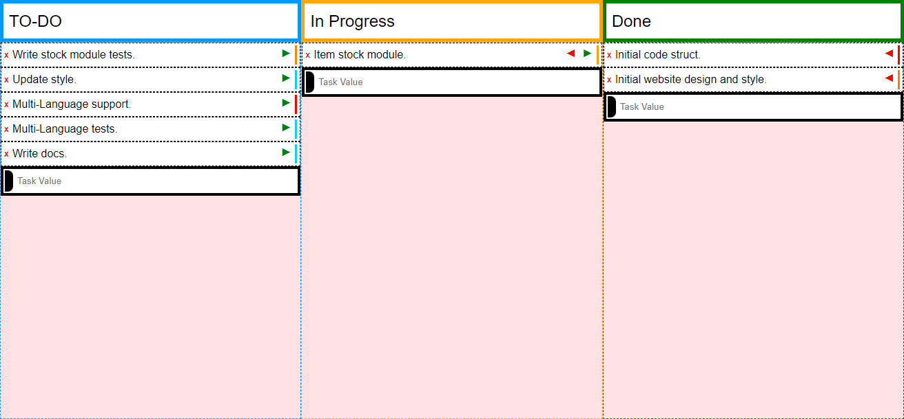
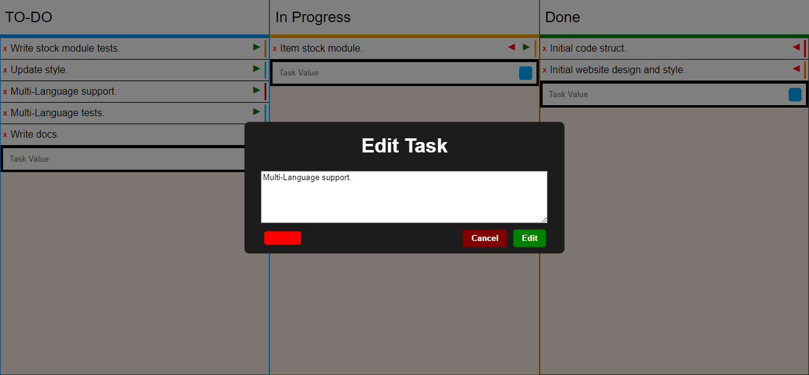

# task-board
## About
JavaScript task board without frameworks or modules. With this project, a board can be created quickly for project management. This project provides board management using MYSQL database, without the need for any modules or frameworks.

## Features
- [X] Stylized Board
- [X] Add Task
- [X] Move Task
- [X] Multi-Language Support
- [X] Delete task
- [X] Logging
- [X] Edit Task
- [X] Task Color
- [X] Task User

## Images
### Main

### Edit Task

## License
[MIT License](LICENSE)